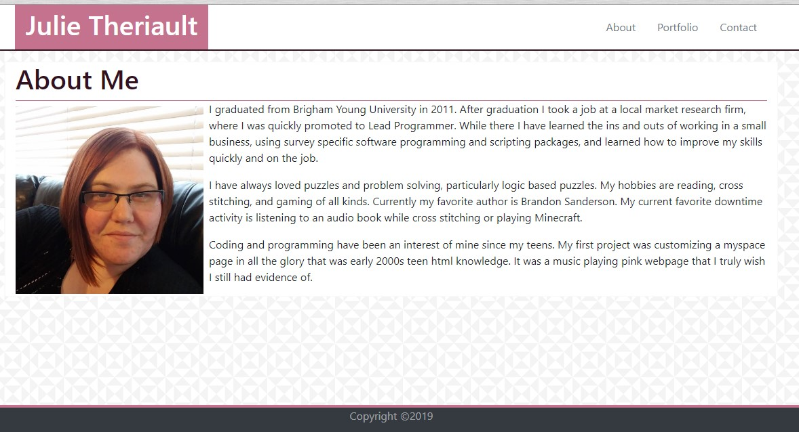
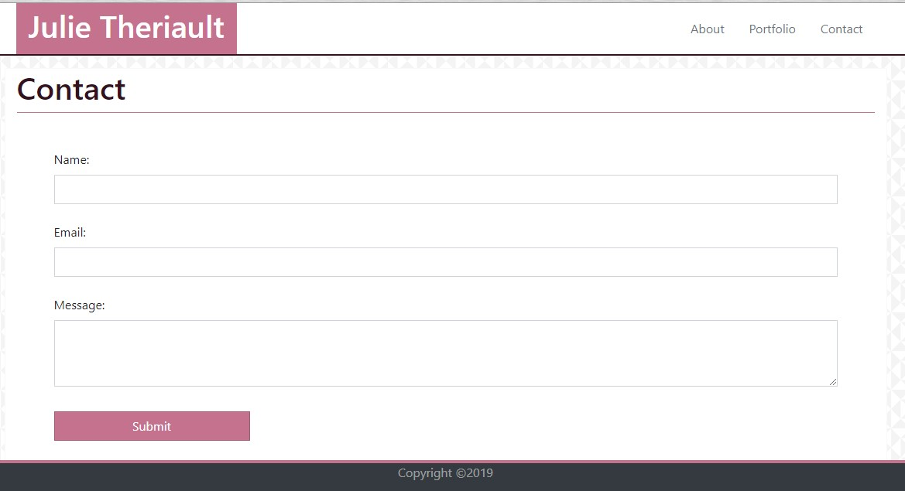
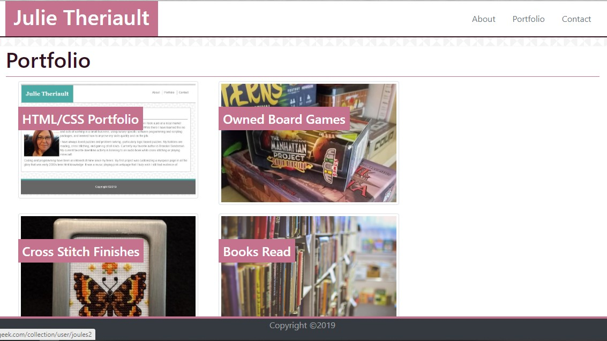

# Responsive Portfolio

## Portfolio description

This is a portfolio to illustrate who I am as programmer and a person, to show what I can bring to the table in a coding environment

This portfolio was designed using HTML and the Bootstrap 4 CSS framework. This was built as a part of the University of Utah Coding Bootcamp, in order to illustrate the use and understanding of using CSS frameworks and responsive web design.

## Usage

Use the navigation links at the top of each page to move around the site.

### About

The about me page provides a brief description of who I am and what I enjoy to do.

### Contact

This form will allow you to contact me regarding this project or any other project or interest showcased.
**This form is not currently functional**

### Portfolio

This page showcases projects and interests that I have. Clicking on the images on this page will take you to where you can find more information about these interests.
